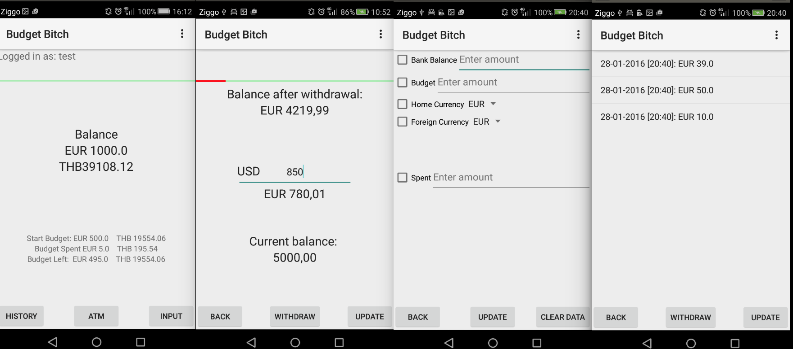

# Report
# Budget Bitch

Michiel van der List (10363521)

###App
Budget Bitch is een app gemaakt voor mensen die te maken krijgen met buitenlandse valuta. Het probleem bij veel van deze valuta, is dat men veel problemen ervaart bij hun uitgaven, omdat men geen gevoel heeft bij de betreffende valuta. Budget Bitch helpt hierbij, doordat de gebruiker een budget vast kan stellen. Het banksaldo van de gebruiker wordt in de eigen valuta, evenals de vreemde valuta weergeven. Daarnaast krijgt de gebruiker een tussenstatus van zijn budget - wederom in beide valuta - te zien. Als klapper op de vuurpijl, geeft deze app een visuele weergave van het nog te besteden bedrag. De gebruiker dient voordat hij gaat pinnen het gewenste bedrag in te voeren. Hierbij zal de gebruiker zien hoeveel dit bedrag is in de eigen valuta. Ook krijgt de gebruiker visueel voorgeschoteld hoeveel dit bedrag ten aanzien van het resterende banksaldo is, dit alles om een daadwerkelijk gevoel te krijgen bij een valuta die de gebruiker niet eigen is. Bovendien is de app in staat een geschiedenis te weergeven van de transacties die de gebruiker gedaan heeft.
	Een bijzonder aspect van deze app, is dat hij zowel offline als online te gebruiken is. Wanneer de gebruiker geen internetverbinding heeft, zal de gebruier hier in het gebruik niets van merken. Dit is relevant, daar de app hoofdzakelijk in het buitenland gebruikt zal worden. Zodra de gebruiker internetverbinding heeft, zal de data op internet geplaatst worden. Hierdoor kunnen meerder gebruikers hetzelfde toestel gebruiken en kan de app cross-platform gebruikt worden. Wanneer de gebruiker offline is geweest, kan de gebruiker kiezen om de locale data te behouden, of de data uit de cloud te gebruiken.

###Ontwerpproces
Het uiteindelijke ontwerp van de app berust op een onderdeel van het originele idee. Het originele idee was om een complete budgetmonitor te maken die in twee valuta werkte. Het probleem hierbij, is dat de gebruiker iedere kleine uitgave in dient te voeren voor een correct functionerende app. Hierdoor is besloten om dit idee te handhaven, maar de focus te leggen op pin transacties. Het idee blijft in stand, maar de gebruiker dient niet tientallen keren per week zijn data bij te houden.

Het eerste probleem waar dit project tegenaan liep was de naamgeveving. Vooral backpackers reizen op budget, waardoor de orginele naam Backpacker's Budget Boss was. Door het woord 'backpacker' in de naam te voegen, ontstaat de kans dat andere potentiele gebruikers zich niet verwelkomd voelen. Daarna is er gekozen voor de naam Budget Boss. Echter, deze naam bleek reeds in gebruik. Aan het eind is de naam veranderd in Budget Boss Baby!. Deze naam is echter te lang om correct weergeven te worden wanneer de app geïnstalleerd is op een android toestel. De uiteindelijke naam is Budget Bitch geworden, niet in de laatste plaats omdat shockeren niet de minst efficiënte manier is om aandacht te verwerven. Zoals hier misschien al opvalt, stond bij aanvang vast, dat een alliteratie ten grondslag moest liggen aan de naamgeving van deze app.

In de eerste week van de ontwikkeling, toen langzaam maar zeker duidelijk werd wat het project uiteindelijk zou moeten gaan behelzen, is er gekozen om de weergave van de transactiegeschiedenis een prominente plek toe te kennen binnen de app. Dit ontziet de gebruiker namelijk van het bijhouden - het zij middels het oude 'huishoudboekje', dan wel in het daadwerkelijk herinneren - van de transacties. Voor de weergave is gekozen voor de vreemde valuta, hoewel de app ruimte laat voor het weergeven van de transactie in beide valuta. Dit is absoluut één van de verbeterpunten van de app vooralsnog, die zijn gebrek te wijten heeft aan het tekkort van tijd. Een deel van deze functie is geïmplementeerd, zodat dit later gemakkelijk opgepakt kan worden.

Voor het opslaan van datasets is gekozen om dit in Json bestanden te doen. Deze bestanden lenen zich uitstekend voor deze app, omdat ze als String opgeslagen kunnen worden. Hierdoor zijn ze gemakkelijk op te slaan in zowel het lokale geheugen van het toestel, als de online database in hetzelfe bestandtype. Tevens worden de valuta vanaf het internet opgehaald in een Json bestand. 

Parse.com voorziet de app van de database die gebruikt wordt voor het online opslaan van de gebruikersgegevens. De gebruiker maakt een account aan binnen de app, waardoor er in de database een nieuwe rij aangemaakt wordt. De account is beveiligd middels een wachtwoord. Ook het emailadres van de gebruiker is vereist, dit zodat contact met de gebruiker mogenlijk is buiten de app. De database bevat alle gegevens die de gebruiker invoert tijdens het gebruik van de app. De keuze die hier gemaakt moest worden, is waar en wanneer de gebruikersgegevens verstuurd moesten worden. Het leek handig om dit allemaal in een keer te doen, daar dit een stuk overzichtelijker is. Een goed moment zou dan zijn bij het afsluiten van de app, of wanneer de gebruiker hier zelf voor kiest. Uiteindelijk is gekozen om iedere aanpassing, overal in de app, te versturen naar de database. Het voordeel hiervan, is dat er geen problemen op zullen treden wanneer de app onjuist afgesloten wordt, of wanneer er plotseling geen verbinding is.

Wellicht het meest uitdagende gedeelte van de ontwikkeling, was om er voor te zorgen dat de app zowel offline als online precies hetzelfde werkt. De gebruiker zal er niets van merken wanneer hij plots zijn internetverbinding verliest. Wanneer de gebruiker inlogt, zal hij gevraagd worden of hij verder wil werken met de data uit de cloud, of dat hij de data op het systeem wil gebruiken. Uiteindelijk is de app dusdanig ontworpen, dat hij volledig vanuit het lokale geheugen kan werken. Op de achtergrond echter, wordt iedere handeling bijgehouden in de online database, waardoor de gebruiker ten alle tijden van gebruikersaccount kan wisselen, of van toestel kan wisselen, zonder dat er gegevens verloren gaan.

Voor de berekeningen die de app maakt, gebruikt de app uitsluitend het datatype 'double'. Een van de problemen die hierbij om de hoek komen, is de onnauwkeurigheid van dit datatype. Door mutaties van de variabele, kan het zijn dat het getal 1.0, als 0.99999999etc. gezien wordt. Ditzelfde probleem treedt ook op bij gebruik van een float, maar een double is een stuk nauwkeuriger. De gebruiker zal hier niets van merken, omdat voor weergave van een getal, het getal afgerond wordt tot twee cijfers achter de punt. Java maakt het mogelijk om de weergave te verranderen. Zo kan de punt van een Double als komma weergeven worden. Tevens wordt het getal 2.00 bijvoorbeeld, als 2.0 opgeslagen. Ook dit kan middels een decimalformat verholpen worden.

###Technisch design

De app is zo ontworpen, dat alle knoppen met dezelfde naam, exact het zelfde doen in iedere activity.

De Back knop zal vanuit iedere activity terugkeren naar het eerste scherm (links)

De Withdraw knop zal naar het tweede scherm gaan

De history knop brengt de gebruiker naar zijn transactiegeschiedenis

De withdraw/atm activity stelt de gebruiker in staat een bedrag van zijn saldo af te trekken. Tijdens het typen wordt de valuta al omgezet naar zijn eigen valuta. Wanneer er op withdraw gedrukt wordt, keert de app terug naar het eerste scherm, waar alle waardes aangepast zijn. Op de achtergrond wordt de wijziging naar de online database verstuurd.

Wanneer de gebruiker op update/input drukt, komt de gebruiker in de gelegenheid om alle waardes handmatig aan te passen. Op het moment dat dit scherm geopend wordt, worden de valutakoersen automatisch van het internet afgehaald, mits er verbinding is. Door op update te drukken worden de waardes aangepast. Als de gebruiker op clear data drukt, worden alle data, zowel online als in het lokale geheugen, terug naar 0 gezet. Wanneer de gebruiker de checkbox aanvinkt en hier een correcte waarde invult, wordt de data offline aangepast en online indien mogelijk

###API's/SDK's

- De gehele app is ontwikkeld binnen het Android Studios framework
- Parse wordt gebruikt als online database voor de gebruikers
- Openexchangerates voorziet de app van de valutakoersen
